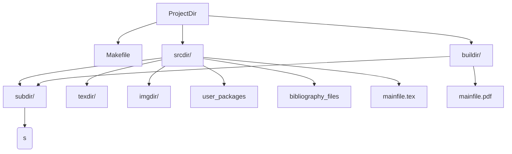

# make-latex

## Introduction

This is a makefile build system to build a fairly large 
[$\LaTeX$](https://www.latex-project.org/) article or book. We use the subfile
system to organise our porject. the makefile can besides your main document, build
all the subfiles indivisually. The main benefit of this makefile is that the document's
source and the build files are seperated, with all buildfiles being written to a
'buildir'.

## features

  - <details>
        <summary>Seperation of build files and source files.</summary>

    `BibTeX` normally doesn't support writing output files to directories outside
    the source file. But here we don't want to clutter our source with build files.
    The workaround is to creat symlinks in the source pointing to the build directory.
    These symlinks can later be removed.
    </details>

  - <details>
        <summary>Configurablity.</summary>

    A number variables allow you to organise your own source directory. the makefile
    will detect all tex files within that directory. Further you can configure
    dependancies with a `config.mk` file, which allows you to do things like build the
    main file even when there are work-in-progress subfiles.
    </details>
  - <details>
        <summary>Automatic detection of source files.</summary>

    As mentioned above, This makefile will detect the source files once you configure your
    project directory structure. This structure needs to be defined only once when you first
    build your project.
    </details>

## Usage

Usage is simple, Downlaod the [makefile](/Makefile) and place it in your project directory:

```bash
cd /path/to/your/project
# Downlaod using curl
curl -sL https://raw.githubusercontent.com/SidhBhat/make-latex/main/Makefile > Makefile
```

After that you will need to do first time configuration by setting some variables within the
makefile:

```makefile
### ------- User Configurable Options ------- ###
## ------------- Latex executables ------------- ##
LATEX       = xelatex
BIBTEX      = bibtex
LATEX_FLAGS = -interaction=batchmode
## ------- Project directories and files ------- ##
# Source Directory: where all your latex files are located
SRCDIR   = src/
# Build Directory: where the build files should be written
BUILDIR  = build/
## NOTE: EVERYTHING BELOW IS RELATIVE TO SOURCE DIRECTORY NOTE ##
# Subfiles Directory: where files compiled as subfiles are located
# NOTE: these files should be compilable as independant latex files
SUBDIR   = subfiles/
# TEX Directory: where you want make to search for your helper scripts
TEXDIR   = tex/
# Image Directory: where you want make to search for your images
IMGDIR   = images/
# The main tex file for the project
MAINFILE = main.tex
# How you want the output pdf file to be called
OUTPUT   = main.pdf
## ---------------------------------------------- ##
# The Shell interpreter
SHELL    = bash
## ---------------------------------------------- ##
```

The comments should guide you pretty good enough.

## Directory Structure

The directory structure expected by make will be:
<!-- Mermaid rendering of flowcharts  -->


# Test Sources

I store the $\LaTeX$ test project that I used to test this makefile in this release here.
Devs can checkout the tag to test the makefile.

# Contributing

I currently have no official channel for contributions, you can simply create a merge request.